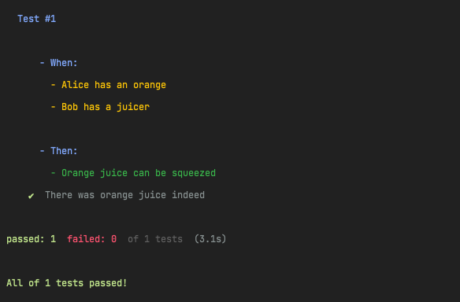

**Purpose:**

To format the comment block in the _tape_ test harness' unit test
 - Lets the unit test be described in greater detail
 - Frees up the description message to allow a unique identifier. So when a test fails it is clear which one

**Nitty gritty:**
 - Add tabs to each comment line such that they are not aligned directly under the test description
 - Removes an extra line that is inserted between each new comment line
 - Colors the When and Then block (differently by default & is configurable)

**Usage:**
<pre>
import test from 'tape';
import { description } from 'tape-comment-formatter';

test('Test #1', (t) => {
    const { script } = description()
        .when(
            `
                - Alice has an orange
                - Bob has a juicer
            `,
        )
        .then(
            `
                - Orange juice can be squeezed
            `,
        );
    t.comment(script);

    // Test body

    t.pass('There was orange juice indeed');
    t.end();
});
</pre>

